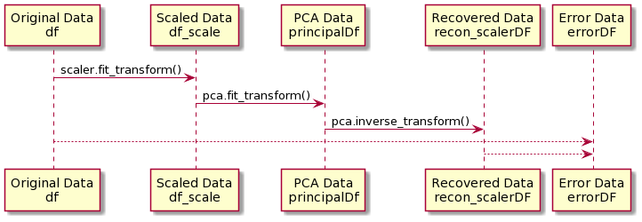
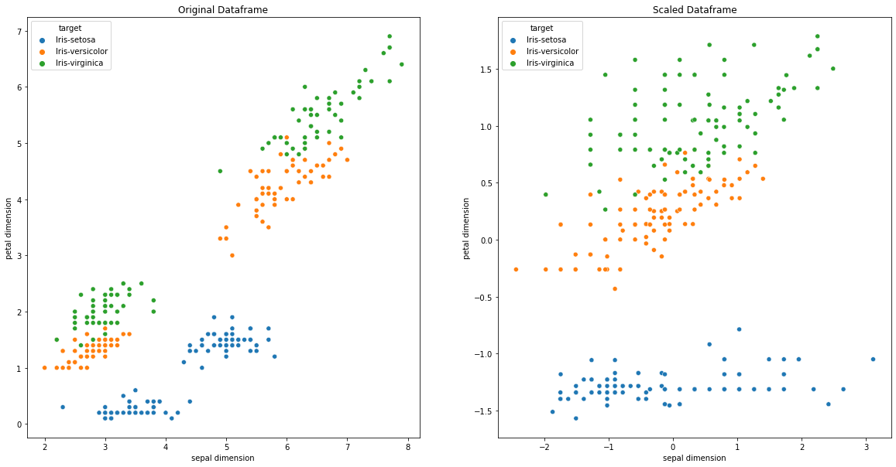
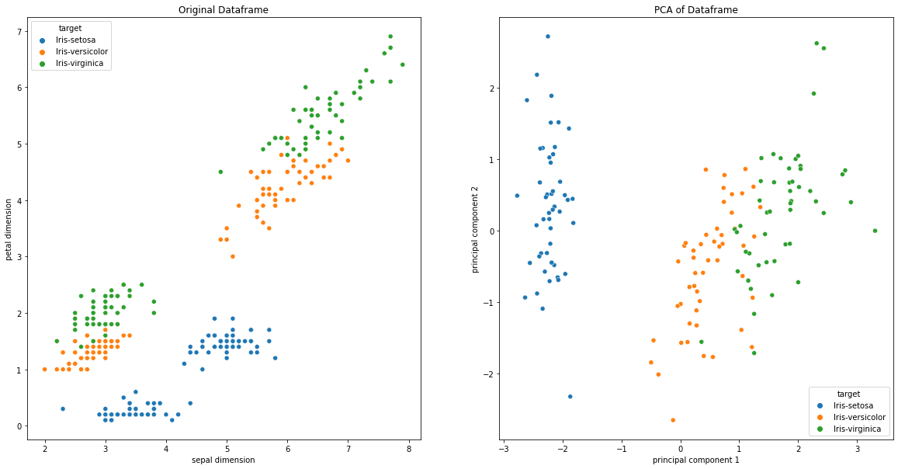
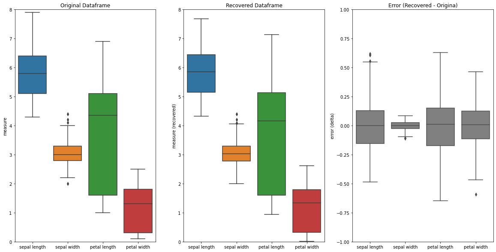

# PCA - A Round Trip

[Kevin Ostheimer](https://www.impulsleistung.de), 2021-10

**Structure**
1. **Why** are we doing this, what's the benefit of it?
1. Encode-Decode **simple** data
1. Encode-Decode **complex** data
1. **Variance-Optimum** for data-compression





```python
import numpy as np # Algebra
import seaborn as sns # Nicer Plotting
import pandas as pd # Dataframes

from sklearn.preprocessing import StandardScaler # Scaling
from sklearn.decomposition import PCA # PCA processing

%matplotlib inline
import matplotlib.pyplot as plt # Multi Plotting

```

## **Why** are we doing this, what's the benefit of it?
We want to **REDUCE** the dimensions of a dataset **FROM** dependent features **TO** fewer **COMPONENTS**


```python
# load dataset into Pandas DataFrame
url = "https://archive.ics.uci.edu/ml/machine-learning-databases/iris/iris.data"
clear_names = ['sepal length','sepal width','petal length','petal width','target']
df = pd.read_csv(url, names=clear_names)
```

For the *Germans*: We're observing the dimensions of the\
Sepal => **Kelchblatt**\
Petal => **Blütenblatt**

# Scale the data


```python
# scale the features
features = ['sepal length', 'sepal width', 'petal length', 'petal width']
# Separating out the features
x = df.loc[:, features].values
# Separating out the target
y = df.loc[:,['target']].values

## For reconstruction ##
scaler = StandardScaler()

# Standardizing the features
x = scaler.fit_transform(x)
```

## What the StandardScaler does:
*StandardScaler()* will normalize the features i.e. each column of x, **individually**, see [Stackoverflow](https://stackoverflow.com/questions/40758562/can-anyone-explain-me-standardscaler)


```python
# let's see how the scaled data looks
df_scale = pd.DataFrame(data=x, columns=features)
df_scale= df_scale.join(df['target'])
```

## Now, we observe the **scaled** data


```python
# All of this is plotting
# Original Dataframe VS Scaled Dataframe
f, axes = plt.subplots(1, 2, figsize=(20,10))

sns.scatterplot(data=df, x="sepal length", y="petal length", hue="target", ax=axes[0]).set_title('Original Dataframe')
sns.scatterplot(data=df, x="sepal width", y="petal width", hue="target", ax=axes[0], legend=False)
axes[0].set(xlabel='sepal dimension', ylabel='petal dimension')

sns.scatterplot(data=df_scale, x="sepal length", y="petal length", hue="target",ax=axes[1]).set_title('Scaled Dataframe')
sns.scatterplot(data=df_scale, x="sepal width", y="petal width", hue="target",ax=axes[1], legend=False)
axes[1].set(xlabel='sepal dimension', ylabel='petal dimension')
```


    [Text(0.5, 0, 'sepal dimension'), Text(0, 0.5, 'petal dimension')]


    

    


# Start the PCA


```python
pca = PCA(n_components=2) # ATTENTION: That's an assumption. Later we want to calculate the (n_components)
principalComponents = pca.fit_transform(x) # The PCA runs on the nummeric block (numpy)

# let's make a Dataframe out of it
principalDf = pd.DataFrame(data = principalComponents, columns = ['principal component 1', 'principal component 2'])
```


```python
# let's make a Dataframe out of it
finalDf = pd.concat([principalDf, df[['target']]], axis = 1)
```


```python
# All of this is plotting
# Original Dataframe VS PCA of Dataframe
f, axes = plt.subplots(1, 2, figsize=(20,10))

sns.scatterplot(data=df, x="sepal length", y="petal length", hue="target", ax=axes[0]).set_title('Original Dataframe')
sns.scatterplot(data=df, x="sepal width", y="petal width", hue="target", ax=axes[0], legend=False).set_title('Original Dataframe')
axes[0].set(xlabel='sepal dimension', ylabel='petal dimension')

sns.scatterplot(data=finalDf, x="principal component 1", y="principal component 2", hue="target", ax=axes[1]).set_title('PCA of Dataframe')

# How much information (variance) could be transform for each component, compared to original
print("The two components variance ratio: "+str(pca.explained_variance_ratio_))
print("The loss of this PCA-Function "+str(1-pca.explained_variance_ratio_.sum()))

```

    The two components variance ratio: [0.72770452 0.23030523]
    The loss of this PCA-Function 0.04199024638518012
    


    

    


## What the PCA plot shows us
* pca1 represents ~72% of information and pca2 represents ~23% of information
* The loss of information is 100% - (pca1[%] + pca2[%]) = ~4%

**The significance of the principal components is ordered from pca1 down to pcaN** because the PCA is hierarchical.

An auto-optimizer will find a reduction, given target variance.

## Inverse the PCA & Scaler


```python
# I want my data back (95% of it)
# the .pca stored all the data, needed for reconversion
recon_pca=pca.inverse_transform(principalComponents)

# let's make a Dataframe out of it
recon_Df = pd.DataFrame(data = recon_pca, columns = clear_names[:4])
recon_Df = recon_Df.join(df['target'])
```


```python
# Data is back from PCA but not scaled
# the .scaler stored all the data, needed for scaling back
recon_scaler   = scaler.inverse_transform(recon_pca)

# let's make a Dataframe out of it
recon_scalerDF = pd.DataFrame(data = recon_scaler, columns = clear_names[:4])
recon_scalerDF = recon_scalerDF.join(df['target'])
```


```python
errorDF = recon_scalerDF[clear_names[:4]] - df[clear_names[:4]]
```

# Oberserve the loss of the roundtrip


```python
f, axes = plt.subplots(1, 3, figsize=(20,10))
axes[0].set(ylim=(0, 8), ylabel='measure')
axes[1].set(ylim=(0, 8), ylabel='measure (recovered)')
axes[2].set(ylim=(-1, 1), ylabel='error (delta)')
sns.boxplot(data=df,  orient='v' , ax=axes[0]).set_title('Original Dataframe')
sns.boxplot(data=recon_scalerDF,  orient='v' , ax=axes[1]).set_title('Recovered Dataframe')
sns.boxplot(data=errorDF,   ax=axes[2], orient="v", color='grey').set_title('Error (Recovered - Origina)')
```


    Text(0.5, 1.0, 'Error (Recovered - Origina)')


    

    


## Remarks on the plots
* There's no offset error: The mean-error is centered to 0
* The [IQR](https://en.wikipedia.org/wiki/Box_plot) of the error plot shows that around 50% of all recovered data is around +- 0.1 in bound of its absolute value

## Sources
* [Michael Galarnyk](https://towardsdatascience.com/pca-using-python-scikit-learn-e653f8989e60), 2017
* [Scikit](https://scikit-learn.org/stable/), 2021
